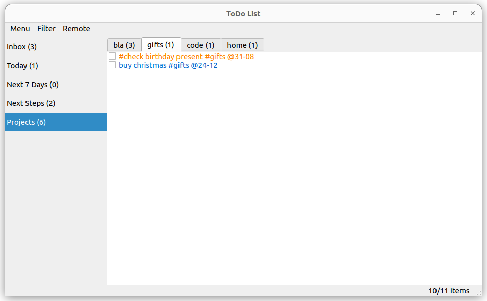

# tdl
ToDo Lists as I had on paper...



## Usage

```
>todo-list.py --help
usage: todo-list utility [-h] [--database DATABASE]
                         [--cleanup-time CLEANUP_TIME]
                         [--redmine-link-prefix REDMINE_LINK_PREFIX]
                         [--jira-link-prefix JIRA_LINK_PREFIX]

optional arguments:
  -h, --help            show this help message and exit
  --database DATABASE   Database file to load/store
  --cleanup-time CLEANUP_TIME
                        Duration in hours after which finished items are
                        removed
  --redmine-link-prefix REDMINE_LINK_PREFIX, --issue-link-prefix REDMINE_LINK_PREFIX
                        Prefix for links to Redmine bugtracker entries
  --jira-link-prefix JIRA_LINK_PREFIX
                        Prefix for links to Jira bugtracker entries
```

## Create and Close Items

Create a new item by double clicking the last line of a tab.
An item is closed by checking the checkbox at the left side. It will be removed from the list after `--cleanup-time` seconds.

## Hashtags and Tabs

Hashtags are used to group items. You can add tabs based on hashtags via the *Filter* menu.

Special tabs:
* The *All* tab shows alls items
* The *Due* tab summarizes items with a due date
* The *Issues* tab shows items with a issue tracker reference

## Due Dates

You can add due dates to an item via following syntactic elements

* *@Xd* due to X days (e.g. *@3d*)
* *@d-m* due to date d.m. This is the default reprensentation, into all others are converted to. (e.g. *@24-12*)
* *@(mo|di|mi|do|fr|sa|so)* due to next (german) weekday (e.g. *@do*)

Due dates are used to sort the items in a tab, earliest at the top. Further, items with due dates are coloured.
* blue: item with a due date
* oragne: due date expires today
* red: due date is in the past

## Issue Tracker References

References to issue trackers can be added for
* *Redmine* via *#[0-9]+*
* Jira via *[A-Z]+-[0-9]+*

The corresponding webpacge is opended when you right click on the item.
This needs the `*-link-prefix` argument set for the coressponding issue tracker.
